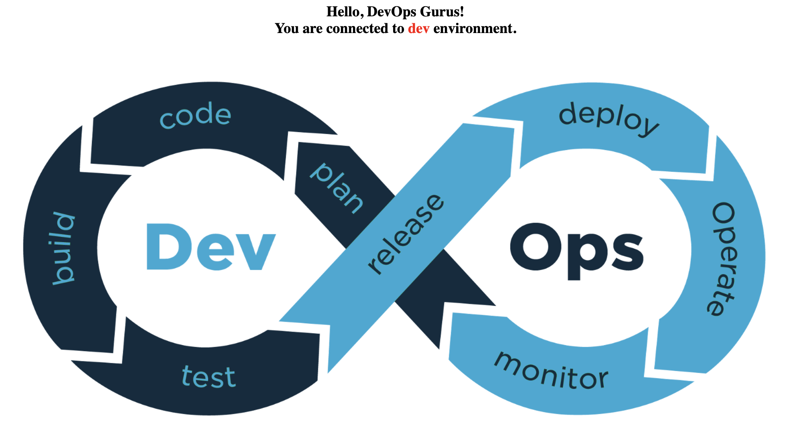

<a name="readme-top"></a>

<!-- PROJECT LOGO -->
<br />
<div align="center">
  <a href="https://github.com/eevlogiev/flask-app">
    
  </a>
<h2 align="center">Flask Application Project</h2>
</div>
      <br />
      <br />

[![AWS][AWS]][AWS-url][![Terraform][Terraform]][Terraform-url][![Docker][Docker]][Docker-url][![Kubernetes][Kubernetes]][Kubernetes-url][![Helm][Helm]][Helm-url][![Python][Python]][Python-url][![Flask][Flask]][Flask-url][![Nginx][Nginx]][Nginx-url]

<!-- TABLE OF CONTENTS -->
<details>
  <summary>Table of Contents</summary>
  <ol>
    <li>
      <a href="#overview">Overview</a>
    </li>
    <li>
      <a href="#getting-started">Getting Started</a>
      <ul>
        <li><a href="#how-does-it-work">How does it work?</a></li>
          <ul>
            <li><a href="#1-kubernetes-namespace-deployment">Kubernetes Namespace Deployment</a></li>
            <li><a href="#2-deployment-components">Deployment Components</a></li>
            <li><a href="#3-flask-application-behavior">Flask Application Behavior</a></li>
          </ul>
        <li><a href="#prerequisites">Prerequisites</a></li>
        <li><a href="#installation">Installation</a></li>
      </ul>
    </li>
    <li><a href="#usage">Usage</a></li>
      <ul>
        <li><a href="#deploy-aws-infrastructure">Deploy AWS infrastructure</a></li>
        <li><a href="#deploy-flask-application">Deploy Flask application</a></li>
          <ul>
            <li><a href="#deploy-to-development-environment">Deploy to Development environment</a></li>
            <li><a href="#deploy-to-production-environment">Deploy to Production environment</a></li>
          </ul>
      </ul>
    <li><a href="#contact">Contact</a></li>
    <li><a href="#version-history">Version History</a></li>
    <li><a href="#license">License</a></li>
  </ol>
</details>

<!-- ABOUT THE PROJECT -->
## Overview

This project leverages Terraform to provision AWS resources, including VPC components, EC2 instances, Elastic Container Registry (ECR) and IAM roles. Additionally, it orchestrates the deployment of an Amazon Elastic Kubernetes Service (EKS) cluster.

Once the EKS cluster is operational, it hosts a Flask application within NGINX servers orchestrated by Kubernetes pods. To access the web application NGINX ingress controller will be installed. Furthermore, the setup incorporates Kubernetes add-ons such as external-dns and cert-manager. These components facilitate the automatic management of SSL certificates and the dynamic updating of DNS records in Route 53 for a specified domain.

To add more automation to the process - both deployment of the infrastructure and the application deployment are being handled by Github Actions pipelines.

<p align="right">(<a href="#readme-top">back to top</a>)</p>

<!-- GETTING STARTED -->
## Getting Started

### How does it work?
This GitHub repository utilizes GitHub Actions for triggering Terraform deployments to AWS. Once Terraform successfully creates all the necessary underlying infrastructure, a Flask application is deployed via a CI/CD Pipeline.

#### 1. Kubernetes Namespace Deployment
To enhance security and maintain separation, the application is deployed within a dedicated Kubernetes namespace ("Environment") based on the current Git branch where changes are pushed. For instance, commits made to the `dev` branch trigger the creation of Kubernetes pods within the `dev` namespace.

#### 2. Deployment Components
The Flask app deployment process involves the creation of essential components:
* **NGINX Servers:** Two NGINX server pods are deployed to host the Flask application.
* **NGINX Ingress Controller:** Responsible for handling incoming HTTP requests, redirecting them to HTTPS, and routing requests to the appropriate ClusterIP service based on the URL path.
* **LoadBalancer Service:** Creates classic AWS Loadbalancer, vital part of the NGINX controller
* **ClusterIP Service:** Exposes port 80 and forwards incoming connections to the respective pods located in specific namespaces based on the `Environment` variable.
* **External-DNS Addon:** Creates a DNS A record in Route 53 based on the `Environment` variable: <`Environment`>.<your-domain.name>
* **Certificate Manager:** Manages the creation and installation of SSL certificates via the third-party SSL Provider [Let's Encrypt](https://letsencrypt.org/) for <`Environment`>.<your-domain.name>.
  
For example if changes are being committed to `Dev` branch, pipeline will create pods, NGINX ingress controller and ClusterIP service in `dev` namespace in Kubernetes cluster. Also External-DNS addon will create an A record for `dev`.<your-domain.name> and SSL certificate will be installed for `dev`.<your-domain.name>.

#### 3. Flask Application Behavior
The Flask application dynamically visualizes the Environment variable on the screen. For instance, if changes are committed to the dev branch, accessing `dev`.<your-domain.name> in a browser will confirm connection to the Dev environment.


### Prerequisites

* Git and Github account
* Docker
* Terraform
* Pre-commit hooks - tflint, helm lint
* AWS CLI
* Registered domain name
* [SonarCloud](https://www.sonarsource.com/products/sonarcloud/) and [Snyk](https://app.snyk.io) accounts
* AWS user with write privileges to create S3 bucket, DynamoDB table, IAM role, OIDC provider

### Installation

1. Fork this github [repo](https://github.com/eevlogiev/telerik-flask-project).
2. Set repository secrets.
   In "Secrets and Varibles" setting page of you repository add the following Repository Secrets which you will need further for your pipeline:
   * `SONAR_TOKEN` - this is the token used to authenticate access to SonarCloud. You can generate a token on your [Security page in SonarCloud](https://sonarcloud.io/account/security/).
   * `SNYK_TOKEN` - this token is needed to authenticate to Snyk vulnerability scanner. You can get that token following the instructions in [Snyk documentation](https://docs.snyk.io/integrate-with-snyk/git-repositories-scms-integrations-with-snyk/snyk-github-integration).
3. Set Repository variables.
   In "Secrets and Varibles" setting page of you repository add the following Repository Variable which you will need further for your pipeline:
   * `AWS_REGION` - this is the AWS region where infrastructure will be deployed. For example us-east-1, eu-central-1, etc.
4. Authenticate to AWS by adding your Access and Secret keys:

   ```
   aws configure
   ```

5. Clone the repo locally:

   ```
   git clone <forked repo>
   ```

6. Create a new branch, for example `dev`:

   ```
   git branch dev
   git checkout dev
   ```

7. Edit file `terraform/pre-deploy/github.tf` and replace `"repo:eevlogiev/telerik-flask-project:*"` with your repo
8. Deploy initial infrastructure components - S3 bucket, DynamoDB and Github OIDC provider:

   ```
   cd terraform/pre-deploy
   terraform init
   terraform plan
   terraform apply
   ```

9. After successul terraform run, the following files will be updated with the present AWS account id:

   ```
   helm/values.yaml
   terraform/pre-deploy/assume_role.sh
   terraform/pre-deploy/role-arn.txt
   ```

   These files will be needed later during the deployment process.

<p align="right">(<a href="#readme-top">back to top</a>)</p>

<!-- USAGE EXAMPLES -->
## Usage

### Deploy AWS infrastructure

AWS infrastructure needed for the Flask application is being provisioned with **terraform** via Github workflow described in `.github/workflows/terraform.yaml`. This workflow will create a VPC, Subnets, Route tables, Internet Gateway, NAT Gateway, Security groups, ECR, IAM roles, EKS cluster, Helm charts, EKS addons which will be needed later for the application.
This Github action is triggered in case of any change in the `terraform` folder.

1. Update file terraform/locals.tf and replace `ev4o.com` with your registered domain:

    ```
     domain = "{<your domain>}"
    ```

   :warning: Make sure to keep the curly brackets!

2. Commit and push your changes to the remote Github repo:

   ```
   git add <changed files>
   git commit
   git push --set-upstream origin dev
   ```

3. Create a Pull request to merge the changes from `dev` branch into the `main` branch.
4. Pull request will trigger the **Terraform Infrastructure Change Management Pipeline** Github action. This action will add a comment in the PR with the `terraform plan` output but will NOT execute `terraform apply`.
5. Review Pull request - check Commits, suggested file changes and the `terraform plan` output in the **Conversation** section of the PR.
6. Deploy infrastructure in AWS - after peer review click on the **Merge** button in Pull Request Section.
7. Pushing changes to main branch (or Merge into main branch) triggers **Terraform Infrastructure Change Management Pipeline** but this time with `terraform apply` job.
8. Go to **Actions** and check the status of the **Terraform Infrastructure Change Management Pipeline**. If successful - this workflow will create EKS cluster with 2 nodes and all the underlying infrastructure in AWS.

### Deploy Flask application

Once all underlying infrastructure is provisioned in AWS, you can deploy the Flask application. Again application is being installed via Github Actions workflow described in `.github/workflows/deployment.yaml'.
CI/CD Pipeline run the following jobs:
* Code style checks - EditorConfig, Pylint and Black Python linters
* Unit testing - runs simple unit test calling `test_web.py`
* Static Application Security Testing (SAST) - SonarCloud and Snyk vulnerability scanners (make sure you have SONAR_TOKEN and SNYK_TOKEN set in your Repository Secrets first!)
* Build Docker image and tag it with the current Commit hash
* Push Docker image to AWS ECR
* Deploy application by using helm chart

CI/CD Pipeline is being triggered by any change in the folloing locations:
* `/app` folder
* `/helm` folder
* `Dockerfile`
  
#### Deploy to Development environment
1. Update domain name for the web server hosting the Flask application. Change value for domain variable in : `/helm/values.yaml` and replace `ev4o.com` with your registered domain name:

```
domain = <your domain>
```
2. Point the NS servers for your domain to the Route53 DNS servers.
Get the NS records for your AWS hosted zone:
```
aws route53 list-hosted-zones-by-name
aws route53 get-hosted-zone --id <hosted zone id>
```
3. Go to the Domain registrar (like GoDaddy.com) for your domain and configure the NameServers entries listed in the previous step as Nameservers for your domain:

From now on all DNS queries for your registered domain will be handled by AWS Route 53.

4. Commit and push your changes to the remote Github repo:

   ```
   git add <changed files>
   git commit
   git push
   ```
5. Pushing to `dev` branch will trigger the CI/CD Pipeline. If all previous steps are completed successfully, application will be deployed in `dev` environment
6. Verify application deployment:
   ```
   aws eks update-kubeconfig --name flask-cluster --region <AWS region>
   source terraform/pre-deploy/assume_role.sh
   kubectl get pods -n dev
   kubectl get ingress -n dev
   kubectl get svc -n kube-system
   ```
8. Successfull deployment will install a helm chart which creates 2 pods in `dev` namespace where NGINX server will be running, NGINX ingress controller in `dev` namespace, LoadBalancer service in `dev` namespace. It will also request and install SSL certificate for dev.<your domain> and add a DNS record for dev.<your domain> in Route 53.
9. Open dev.<your domain> in your browser and you should get to the landing page of Dev environment.

>


#### Deploy to Production environment
1. Create a Pull request to merge the changes from `dev` branch into the `main` branch.
2. If you are happy with the result, just review the PR and click on **Merge** to merge `dev` into `main` branch.
3. Merging to `main` branch will trigger again the CI/CD Pipeline. If all previous steps are completed successfully, application will be deployed in `prod` environment
4. Verify application deployment:
   ```
   kubectl get pods -n prod
   kubectl get ingress -n prod
   kubectl get svc -n kube-system
   ```
8. Successfull deployment will install a helm chart which creates 2 pods in `prod` namespace where NGINX server will be running, NGINX ingress controller in `prod` namespace, LoadBalancer service in `prod` namespace. It will also request and install SSL certificate for <your domain> and add a DNS record for <your domain> in Route 53.
9. Open <your domain> in your browser and you should get to the landing page of Prod environment.

<!-- CONTACT -->
## Contact

[Evelin Evlogiev](https://www.linkedin.com/in/e-evlogiev/)

<p align="right">(<a href="#readme-top">back to top</a>)</p>

<!-- Version History -->
## Version History

* 0.1
    * Initial Release

<p align="right">(<a href="#readme-top">back to top</a>)</p>

<!-- LICENSE -->
## License

Distributed under the GPL-3.0 License. Further information in the [LICENSE](https://github.com/eevlogiev/telerik-flask-project/blob/main/LICENSE) file.

<p align="right">(<a href="#readme-top">back to top</a>)</p>

<!-- MARKDOWN LINKS & IMAGES -->
<!-- https://www.markdownguide.org/basic-syntax/#reference-style-links -->

[linkedin-shield]: https://img.shields.io/badge/-LinkedIn-black.svg?style=for-the-badge&logo=linkedin&colorB=555
[linkedin-url]: https://www.linkedin.com/in/e-evlogiev/
[AWS]: https://img.shields.io/badge/AWS-FF9900.svg?style=for-the-badge&logo=amazon-aws&logoColor=white
[AWS-url]: https://aws.amazon.com/
[Terraform]: https://img.shields.io/badge/terraform-%235835CC.svg?style=for-the-badge&logo=terraform&logoColor=white
[Terraform-url]: https://www.terraform.io/
[Docker]: https://img.shields.io/badge/docker-0db7ed.svg?style=for-the-badge&logo=docker&logoColor=white
[Docker-url]: https://www.docker.com/
[Kubernetes]: https://img.shields.io/badge/kubernetes-326ce5.svg?style=for-the-badge&logo=kubernetes&logoColor=white
[Kubernetes-url]: https://kubernetes.io/
[Helm]: https://img.shields.io/badge/helm-%230F1689?style=for-the-badge&logo=helm
[Helm-url]: https://helm.sh/
[Python]: https://img.shields.io/badge/python-3670A0?style=for-the-badge&logo=python&logoColor=ffdd54
[Python-url]: https://www.python.org/
[Flask]: https://img.shields.io/badge/flask-%23000.svg?style=for-the-badge&logo=flask&logoColor=white
[Flask-url]: https://flask.palletsprojects.com/en/2.3.x/
[Nginx]: https://img.shields.io/badge/nginx-%23009639.svg?style=for-the-badge&logo=nginx&logoColor=white
[Nginx-url]: https://www.nginx.com/
